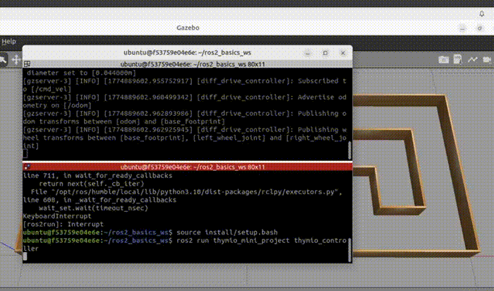

# Thymio ROS2 Maze Navigation Project

ROS2/Gazebo autonomous maze navigation project developed during the EPFL MICRO-453 ROS2 Basics course.

## Authors

- Melvyn Huynh
- Yann Thomé
- Florian Kighelman

## Demo Video

Full video available here: [demo/thymio_ros2_simulation.mp4](demo/thymio_ros2_simulation.mp4)
## Report

[ROS2 Report](report/Rapport__ROS.pdf)
